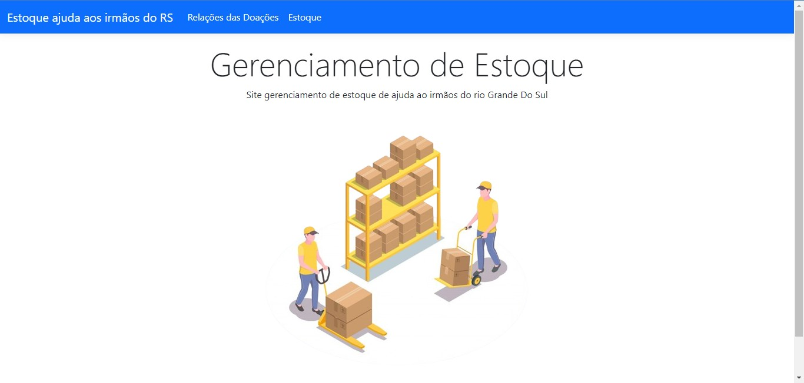
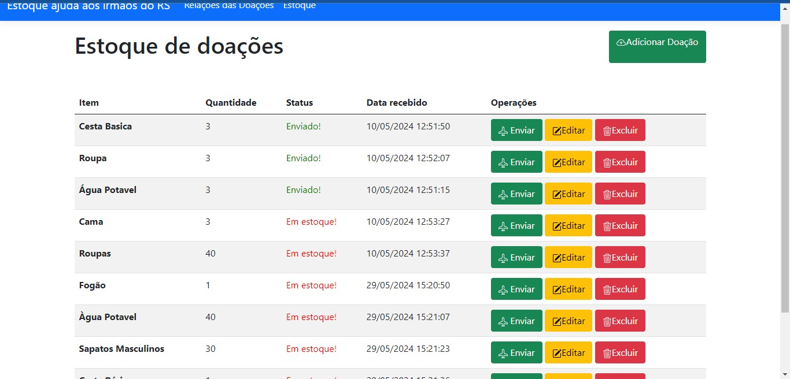
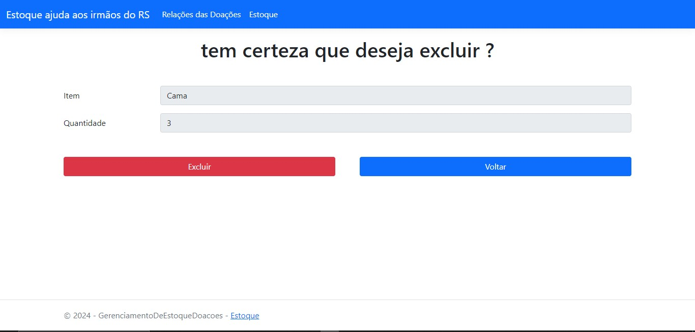
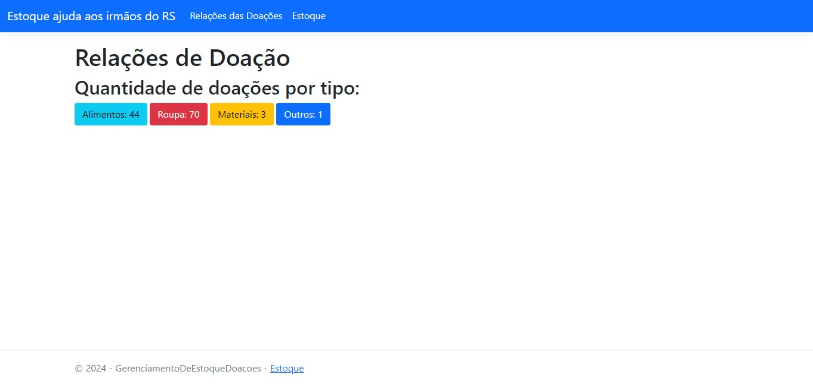

## Doações Para O Rio Grande Do Sul 

🌁 Ao decorrer da catastrofe que foi enfrentada no Sul com enchentes onde muitas pessoas perderam TUDO, suas roupas,camas, eletrodomésticos e ficaram desabrigadas.

Com isso em vista a Igreja Tabernáculo da Fé Uniu suas forças e levantaram arrecadações a serem feitas. Perante a isso, me deparei com o seguinte cenário: Um estoque de doações para serem transportadas. Logo, pensei que seria viável criar um Software para gerenciar a logistica do estoque.



 ## Como funciona ?
- 🌎 Este projeto é um sistema que gerencia um estoque de doações.


## Exemplos De Funcionalidade: 👨🏼‍💻
- **Cadastro De Doações:** Ao cadastrar uma doação, você especifica o tipo dessa doação, se é um alimento, roupa e etc... Sendo assim, ela fica armazenada no estoque:
- - Além disso o estoque conta com as 4 operações: CRUD (Create, Read, Update e Delete). Sendo assim, nesta tela de estoque permite ver, cadastrar excluir a doação.
  **O botão enviar!**

 O Botão enviar é para dizer quando o item ja foi enviado para o rio grande do sul, se ele for enviado a mensagem " enviado! " serpa expressa, caso contrário, será mostrado "Em estoque"


- 


  **Relações de Doações**

  
As relações é responsável por mostrar os números do que foram doados


## Tecnologias Utilizadas
- **Linguagem de Programação:** C#
- **Framework Web:** ASP .NET MVC
- **Banco de Dados:** MySQL

## Instalação e Configuração

- **Clone o repositório:**
 ``` bash
   git clone https://github.com/DanielCamargo1/AgendamentoBackend.git
  ```
- **Instale Os Nuget´s No Visual Stúdio**
   - Microsoft.EntityFrameWorkCore;
   - Microsoft.EntityFrameWorkCore.Design;
   - Microsoft.EntityFrameWorkCore.Tools;
   - Pomelo.EntityFrameWorkCore.MySql;
 
     Agora é só rodar o projeto e testar as funcionalidades 😉
